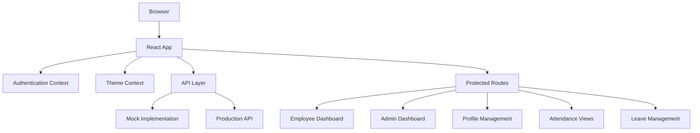

# Design Document: Dayflow Frontend

## Overview

The Dayflow frontend is a modern React application built with Vite and TypeScript that provides a comprehensive HR management interface. The application follows a component-based architecture with centralized state management, role-based routing, and a flexible API abstraction layer that supports both mock and production implementations.

## Architecture

### High-Level Architecture



### Technology Stack

- **Build Tool**: Vite for fast development and optimized production builds
- **Framework**: React 18 with TypeScript for type safety
- **Routing**: React Router v6 for client-side navigation
- **State Management**: React Context API with useReducer for complex state
- **Styling**: CSS Modules with CSS Variables for theming
- **HTTP Client**: Axios for API communication
- **Development**: ESLint, Prettier, and Husky for code quality

## Components and Interfaces

### Core Context Providers

#### AuthContext
```typescript
interface AuthState {
  user: User | null;
  isAuthenticated: boolean;
  isLoading: boolean;
  role: 'employee' | 'admin' | 'hr_officer' | null;
}

interface AuthContextType {
  state: AuthState;
  login: (credentials: LoginCredentials) => Promise<void>;
  logout: () => void;
  updateUser: (user: Partial<User>) => void;
}
```

#### ThemeContext
```typescript
interface ThemeState {
  mode: 'light' | 'dark';
  primaryColor: string;
}

interface ThemeContextType {
  theme: ThemeState;
  toggleTheme: () => void;
  setTheme: (mode: 'light' | 'dark') => void;
}
```

### Component Hierarchy

#### Layout Components
- **AppLayout**: Main application wrapper with navigation and theme provider
- **DashboardLayout**: Common layout for dashboard pages with sidebar and header
- **AuthLayout**: Layout for authentication pages (login, forgot password)

#### Feature Components
- **EmployeeDashboard**: Employee-specific dashboard with quick access cards
- **AdminDashboard**: Admin dashboard with employee management tools
- **ProfileManager**: Profile viewing and editing functionality
- **AttendanceTracker**: Attendance display and check-in/out functionality
- **LeaveManager**: Leave application and approval interface
- **SalaryViewer**: Salary information display component

#### Shared Components
- **EmployeeCard**: Reusable card component for displaying employee information
- **StatusIndicator**: Visual status indicators (🟢, ✈️, 🟡)
- **ThemeToggle**: Dark/light mode toggle component
- **LoadingSpinner**: Consistent loading state component
- **ErrorBoundary**: Error handling wrapper component

### Routing Structure

```typescript
interface RouteConfig {
  path: string;
  element: React.ComponentType;
  protected: boolean;
  roles?: UserRole[];
}

const routes: RouteConfig[] = [
  { path: '/login', element: LoginPage, protected: false },
  { path: '/dashboard', element: DashboardPage, protected: true },
  { path: '/profile', element: ProfilePage, protected: true },
  { path: '/attendance', element: AttendancePage, protected: true },
  { path: '/leave', element: LeavePage, protected: true },
  { path: '/admin', element: AdminPage, protected: true, roles: ['admin', 'hr_officer'] },
];
```

## Data Models

### User Model
```typescript
interface User {
  id: string;
  loginId: string; // Format: OI[FirstName][LastName][Year][SerialNumber]
  email: string;
  firstName: string;
  lastName: string;
  role: 'employee' | 'admin' | 'hr_officer';
  profilePicture?: string;
  personalDetails: PersonalDetails;
  jobDetails: JobDetails;
  salaryInfo: SalaryInfo;
  attendanceStatus: AttendanceStatus;
}

interface PersonalDetails {
  phone: string;
  address: string;
  dateOfBirth: string;
  emergencyContact: EmergencyContact;
}

interface JobDetails {
  department: string;
  position: string;
  joiningDate: string;
  reportingManager: string;
  workingSchedule: WorkingSchedule;
}

interface SalaryInfo {
  wageType: 'fixed';
  monthlyWage: number;
  components: SalaryComponent[];
  deductions: Deduction[];
}
```

### Attendance Model
```typescript
interface AttendanceRecord {
  id: string;
  employeeId: string;
  date: string;
  checkIn?: string;
  checkOut?: string;
  breakTime: number; // minutes
  workingHours: number;
  status: 'present' | 'absent' | 'half-day' | 'leave';
  remarks?: string;
}

interface AttendanceStatus {
  current: 'present' | 'absent' | 'on-leave';
  lastCheckIn?: string;
  lastCheckOut?: string;
}
```

### Leave Model
```typescript
interface LeaveRequest {
  id: string;
  employeeId: string;
  type: 'paid' | 'sick' | 'unpaid';
  startDate: string;
  endDate: string;
  days: number;
  reason: string;
  status: 'pending' | 'approved' | 'rejected';
  appliedDate: string;
  approvedBy?: string;
  approvedDate?: string;
  comments?: string;
}

interface LeaveBalance {
  employeeId: string;
  paidLeave: number;
  sickLeave: number;
  totalUsed: number;
  year: number;
}
```

### Salary Component Model
```typescript
interface SalaryComponent {
  id: string;
  name: 'basic' | 'hra' | 'standard_allowance' | 'performance_bonus' | 'lta' | 'fixed_allowance';
  displayName: string;
  computationType: 'fixed_amount' | 'percentage_of_wage' | 'percentage_of_basic';
  value: number; // percentage or fixed amount
  calculatedAmount: number;
}

interface Deduction {
  id: string;
  name: 'pf' | 'professional_tax' | 'other';
  displayName: string;
  rate: number; // percentage
  amount: number;
}
```

## API Layer Design

### API Abstraction Layer (api.ts)

The API layer provides a clean abstraction that can switch between mock and production implementations:

```typescript
interface ApiClient {
  auth: AuthApi;
  employees: EmployeeApi;
  attendance: AttendanceApi;
  leave: LeaveApi;
  salary: SalaryApi;
}

interface AuthApi {
  login(credentials: LoginCredentials): Promise<AuthResponse>;
  logout(): Promise<void>;
  refreshToken(): Promise<AuthResponse>;
  getCurrentUser(): Promise<User>;
}

interface EmployeeApi {
  getProfile(id: string): Promise<User>;
  updateProfile(id: string, data: Partial<User>): Promise<User>;
  getEmployees(): Promise<User[]>; // Admin only
  createEmployee(data: CreateEmployeeRequest): Promise<User>; // Admin only
}
```

### Mock Implementation Strategy

The mock implementation will:
- Use localStorage for data persistence during development
- Simulate realistic API delays with setTimeout
- Generate realistic test data with proper relationships
- Handle authentication state with JWT-like tokens
- Provide error scenarios for testing error handling

```typescript
class MockApiClient implements ApiClient {
  private delay = (ms: number) => new Promise(resolve => setTimeout(resolve, ms));
  
  auth = {
    async login(credentials: LoginCredentials): Promise<AuthResponse> {
      await this.delay(800); // Simulate network delay
      // Mock authentication logic
      return mockAuthResponse;
    }
  };
}
```

## Theme System Design

### CSS Variables Architecture

The theme system uses CSS custom properties for dynamic theming:

```css
:root {
  /* Light theme (default) */
  --color-primary: #ff6b35; /* Orange brand color */
  --color-primary-light: #ff8c5a;
  --color-primary-dark: #e55a2b;
  
  --color-background: #ffffff;
  --color-surface: #f8f9fa;
  --color-text-primary: #212529;
  --color-text-secondary: #6c757d;
  
  --color-success: #28a745;
  --color-warning: #ffc107;
  --color-error: #dc3545;
  --color-info: #17a2b8;
}

[data-theme="dark"] {
  --color-background: #1a1a1a;
  --color-surface: #2d2d2d;
  --color-text-primary: #ffffff;
  --color-text-secondary: #b0b0b0;
  
  /* Keep brand colors consistent */
  --color-primary: #ff6b35;
  --color-primary-light: #ff8c5a;
  --color-primary-dark: #e55a2b;
}
```

### Theme Context Implementation

```typescript
const ThemeProvider: React.FC<{ children: React.ReactNode }> = ({ children }) => {
  const [theme, setTheme] = useState<ThemeState>(() => {
    const saved = localStorage.getItem('dayflow-theme');
    return saved ? JSON.parse(saved) : { mode: 'light', primaryColor: '#ff6b35' };
  });

  const toggleTheme = useCallback(() => {
    const newMode = theme.mode === 'light' ? 'dark' : 'light';
    const newTheme = { ...theme, mode: newMode };
    setTheme(newTheme);
    localStorage.setItem('dayflow-theme', JSON.stringify(newTheme));
    document.documentElement.setAttribute('data-theme', newMode);
  }, [theme]);

  return (
    <ThemeContext.Provider value={{ theme, toggleTheme, setTheme }}>
      {children}
    </ThemeContext.Provider>
  );
};
```

## Authentication Flow Design

### Authentication State Management

```typescript
const authReducer = (state: AuthState, action: AuthAction): AuthState => {
  switch (action.type) {
    case 'LOGIN_START':
      return { ...state, isLoading: true };
    case 'LOGIN_SUCCESS':
      return {
        ...state,
        isLoading: false,
        isAuthenticated: true,
        user: action.payload.user,
        role: action.payload.user.role,
      };
    case 'LOGIN_FAILURE':
      return { ...state, isLoading: false, error: action.payload.error };
    case 'LOGOUT':
      return { user: null, isAuthenticated: false, isLoading: false, role: null };
    default:
      return state;
  }
};
```

### Protected Route Implementation

```typescript
const ProtectedRoute: React.FC<ProtectedRouteProps> = ({ 
  children, 
  roles = [] 
}) => {
  const { state } = useAuth();
  
  if (!state.isAuthenticated) {
    return <Navigate to="/login" replace />;
  }
  
  if (roles.length > 0 && !roles.includes(state.role!)) {
    return <Navigate to="/unauthorized" replace />;
  }
  
  return <>{children}</>;
};
```

## Real-time Updates Design

### Status Update Strategy

For real-time status updates, the application will:
- Use polling for attendance status updates (every 30 seconds)
- Implement optimistic updates for user actions
- Cache status data with automatic refresh
- Handle offline scenarios gracefully

```typescript
const useAttendanceStatus = (employeeId: string) => {
  const [status, setStatus] = useState<AttendanceStatus | null>(null);
  
  useEffect(() => {
    const fetchStatus = async () => {
      try {
        const response = await api.attendance.getStatus(employeeId);
        setStatus(response);
      } catch (error) {
        console.error('Failed to fetch attendance status:', error);
      }
    };
    
    fetchStatus();
    const interval = setInterval(fetchStatus, 30000); // Poll every 30 seconds
    
    return () => clearInterval(interval);
  }, [employeeId]);
  
  return status;
};
```

## Error Handling Strategy

### Error Boundary Implementation

```typescript
class ErrorBoundary extends React.Component<ErrorBoundaryProps, ErrorBoundaryState> {
  constructor(props: ErrorBoundaryProps) {
    super(props);
    this.state = { hasError: false, error: null };
  }

  static getDerivedStateFromError(error: Error): ErrorBoundaryState {
    return { hasError: true, error };
  }

  componentDidCatch(error: Error, errorInfo: React.ErrorInfo) {
    console.error('Error caught by boundary:', error, errorInfo);
    // Log to error reporting service
  }

  render() {
    if (this.state.hasError) {
      return <ErrorFallback error={this.state.error} />;
    }

    return this.props.children;
  }
}
```

### API Error Handling

```typescript
const apiErrorHandler = (error: AxiosError) => {
  if (error.response?.status === 401) {
    // Handle authentication errors
    authContext.logout();
    navigate('/login');
  } else if (error.response?.status >= 500) {
    // Handle server errors
    toast.error('Server error. Please try again later.');
  } else {
    // Handle client errors
    toast.error(error.response?.data?.message || 'An error occurred');
  }
};
```

Now I need to use the prework tool to analyze the acceptance criteria before writing the correctness properties:

<function_calls>
<invoke name="prework">
<parameter name="featureName">dayflow-frontend

## Correctness Properties

*A property is a characteristic or behavior that should hold true across all valid executions of a system—essentially, a formal statement about what the system should do. Properties serve as the bridge between human-readable specifications and machine-verifiable correctness guarantees.*

Based on the prework analysis, I've identified several properties that can be combined for more comprehensive testing while eliminating redundancy:

### Property Reflection

After reviewing all testable criteria from the prework analysis, I've identified several areas where properties can be consolidated:
- Authentication flow properties (1.1-1.5) can be combined into comprehensive authentication testing
- Dashboard rendering properties (2.1-2.5, 3.1-3.5) can be consolidated by role
- Profile management properties (4.3-4.5) can be combined into permission-based testing
- Status update properties (10.1-10.5) can be unified into real-time update testing
- API layer properties (8.1-8.5) can be consolidated into API abstraction testing

### Core Properties

**Property 1: Authentication Flow Integrity**
*For any* valid user credentials and role combination, the authentication system should successfully authenticate the user, store the authentication state securely, redirect to the appropriate dashboard, and maintain role-based access control throughout the session.
**Validates: Requirements 1.1, 1.3, 1.5**

**Property 2: Authentication Error Handling**
*For any* invalid credentials or authentication errors, the system should display clear, user-friendly error messages and maintain security by not revealing sensitive information.
**Validates: Requirements 1.2**

**Property 3: Logout Consistency**
*For any* authenticated user, the logout action should completely clear all authentication state, redirect to the login page, and prevent access to protected routes.
**Validates: Requirements 1.4**

**Property 4: Role-Based Dashboard Rendering**
*For any* authenticated user, the dashboard should display role-appropriate interface elements, with employees seeing personal quick-access cards and admins seeing management tools and employee lists.
**Validates: Requirements 2.1, 2.5, 3.1, 3.5**

**Property 5: Employee Card Information Completeness**
*For any* employee card displayed in the system, it should contain the employee's profile picture, basic information, and appropriate status indicators based on their current attendance state.
**Validates: Requirements 2.2, 2.3**

**Property 6: Navigation Consistency**
*For any* clickable interface element (cards, buttons, links), the system should navigate to the correct destination and maintain proper state throughout the navigation.
**Validates: Requirements 2.4, 3.2, 4.1**

**Property 7: Data Access Permissions**
*For any* user viewing data (attendance, leave records, profiles), the system should enforce role-based permissions, showing employees only their own data and admins the appropriate administrative data.
**Validates: Requirements 5.3, 5.4, 6.3, 6.4**

**Property 8: Profile Management Permissions**
*For any* profile editing operation, the system should enforce field-level permissions, allowing employees to edit only limited fields while admins can modify all employee details.
**Validates: Requirements 4.4, 4.5**

**Property 9: Attendance Status Updates**
*For any* attendance action (check-in, check-out), the system should immediately update both the attendance record and all visual status indicators across all relevant views.
**Validates: Requirements 5.1, 10.1, 10.2**

**Property 10: Leave Management Workflow**
*For any* leave request operation (apply, approve, reject), the system should provide all required input options, display correct status information, and reflect status changes immediately across all views.
**Validates: Requirements 6.1, 6.2, 6.5, 10.3**

**Property 11: Salary Information Display**
*For any* salary information view, the system should display all required components (Basic, HRA, Standard Allowance, Performance Bonus, LTA, Fixed Allowance) with correct calculations and ensure totals do not exceed the defined wage.
**Validates: Requirements 7.1, 7.2, 7.3, 7.5**

**Property 12: Salary Calculation Updates**
*For any* wage amount change, the system should automatically recalculate and update all dependent salary component values while maintaining calculation accuracy.
**Validates: Requirements 7.4**

**Property 13: API Layer Abstraction**
*For any* API operation, the system should route all backend communication through the abstraction layer, handle authentication and errors consistently, and maintain compatibility between mock and production implementations.
**Validates: Requirements 8.1, 8.2, 8.3, 8.4, 8.5**

**Property 14: Theme System Consistency**
*For any* theme operation (toggle, switch), the system should apply the selected theme across all components, persist user preferences, maintain the orange brand color, and ensure accessibility standards are met.
**Validates: Requirements 9.3, 9.4, 9.5**

**Property 15: Responsive Design Adaptation**
*For any* screen size or device type, the system should provide appropriate responsive layout, clear visual feedback for interactions, and maintain usability across desktop, tablet, and mobile devices.
**Validates: Requirements 9.1, 9.2**

**Property 16: Error Handling Consistency**
*For any* error condition, the system should display user-friendly error messages with clear next steps and handle the error gracefully without breaking the application flow.
**Validates: Requirements 9.6**

**Property 17: Real-time Status Consistency**
*For any* status change (attendance, leave approval), the system should maintain consistency across dashboard cards and detailed views, update all relevant indicators, and provide appropriate loading states during updates.
**Validates: Requirements 10.4, 10.5**

**Property 18: Attendance Information Completeness**
*For any* attendance display, the system should show day-wise attendance for the current month by default and include all required details (working time, break information) based on the user's role and permissions.
**Validates: Requirements 5.2, 5.5**

**Property 19: Profile Information Completeness**
*For any* profile view, the system should display all required sections (personal details, job details, salary structure, documents, profile picture) with appropriate data based on user permissions.
**Validates: Requirements 4.3**

## Error Handling

### Error Categories and Strategies

**Authentication Errors**
- Invalid credentials: Clear error message without revealing whether email or password is incorrect
- Session expiration: Automatic redirect to login with session timeout message
- Network errors: Retry mechanism with exponential backoff

**API Errors**
- 4xx Client Errors: Display user-friendly messages with actionable guidance
- 5xx Server Errors: Generic error message with retry option and error reporting
- Network timeouts: Offline indicator with retry functionality

**Validation Errors**
- Form validation: Real-time field validation with clear error indicators
- Data consistency: Prevent invalid state transitions with appropriate messaging
- File upload errors: Clear feedback on file size, type, and upload failures

**UI Errors**
- Component rendering errors: Error boundaries with fallback UI
- Route not found: Custom 404 page with navigation options
- Permission denied: Clear messaging with suggested actions

### Error Recovery Mechanisms

```typescript
interface ErrorRecoveryStrategy {
  retry: boolean;
  maxRetries: number;
  fallbackAction?: () => void;
  userMessage: string;
}

const errorStrategies: Record<string, ErrorRecoveryStrategy> = {
  'NETWORK_ERROR': {
    retry: true,
    maxRetries: 3,
    userMessage: 'Network error. Retrying...'
  },
  'VALIDATION_ERROR': {
    retry: false,
    maxRetries: 0,
    userMessage: 'Please check your input and try again.'
  },
  'PERMISSION_DENIED': {
    retry: false,
    maxRetries: 0,
    fallbackAction: () => navigate('/dashboard'),
    userMessage: 'You do not have permission to access this resource.'
  }
};
```

## Testing Strategy

### Dual Testing Approach

The frontend will implement both unit testing and property-based testing to ensure comprehensive coverage:

**Unit Tests**
- Focus on specific examples, edge cases, and error conditions
- Test individual component behavior and integration points
- Verify specific user interactions and UI state changes
- Test error scenarios and boundary conditions

**Property-Based Tests**
- Verify universal properties across all valid inputs
- Test authentication flows with generated user data
- Validate theme switching across different component states
- Ensure API layer consistency with various request/response combinations
- Test responsive design across generated screen size ranges

### Testing Framework Configuration

**Testing Stack**
- **Unit Testing**: Vitest with React Testing Library
- **Property-Based Testing**: fast-check library for TypeScript
- **E2E Testing**: Playwright for critical user journeys
- **Visual Testing**: Chromatic for UI regression testing

**Property Test Configuration**
- Minimum 100 iterations per property test
- Each property test references its design document property
- Tag format: **Feature: dayflow-frontend, Property {number}: {property_text}**

**Test Organization**
```
src/
├── components/
│   ├── __tests__/
│   │   ├── EmployeeCard.test.tsx
│   │   └── EmployeeCard.property.test.tsx
├── hooks/
│   ├── __tests__/
│   │   ├── useAuth.test.tsx
│   │   └── useAuth.property.test.tsx
└── utils/
    ├── __tests__/
    │   ├── api.test.ts
    │   └── api.property.test.ts
```

### Property Test Examples

```typescript
// Example property test for authentication
describe('Property 1: Authentication Flow Integrity', () => {
  it('should handle any valid credentials correctly', () => {
    fc.assert(fc.property(
      fc.record({
        email: fc.emailAddress(),
        password: fc.string({ minLength: 8 }),
        role: fc.constantFrom('employee', 'admin', 'hr_officer')
      }),
      async (credentials) => {
        // Feature: dayflow-frontend, Property 1: Authentication Flow Integrity
        const result = await authService.login(credentials);
        expect(result.isAuthenticated).toBe(true);
        expect(result.user.role).toBe(credentials.role);
        expect(localStorage.getItem('auth-token')).toBeTruthy();
      }
    ), { numRuns: 100 });
  });
});
```

### Testing Coverage Goals

- **Unit Test Coverage**: Minimum 80% code coverage
- **Property Test Coverage**: All 19 correctness properties implemented
- **Integration Test Coverage**: Critical user journeys (login, dashboard navigation, attendance tracking)
- **Accessibility Testing**: WCAG 2.1 AA compliance verification
- **Performance Testing**: Core Web Vitals monitoring

The testing strategy ensures that both specific functionality and universal properties are thoroughly validated, providing confidence in the application's correctness and reliability.